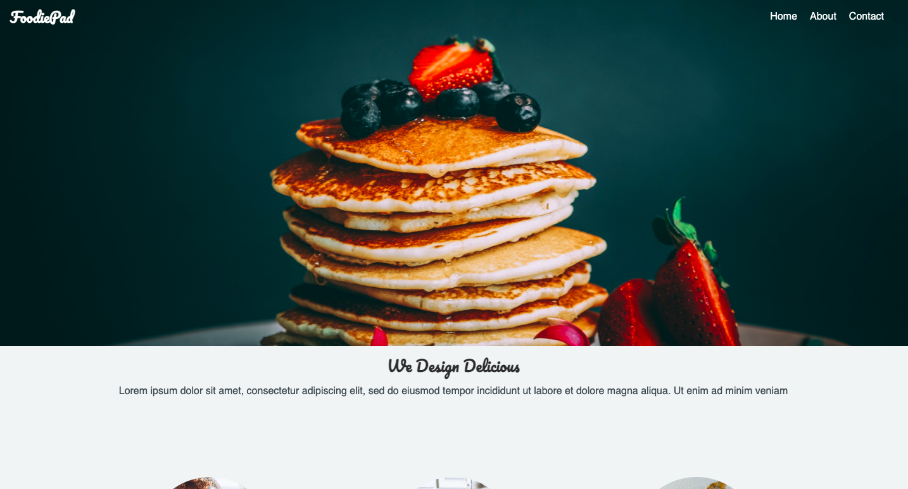

### Foodiepad, A landing page of my favorite restaurant.  

## Built with

- HTML/CSS
- JAVASCRIPT
- WEBPACK

# Getting Started

> clone repository into your computer by running in terminal

> ``git clone https://github.com/juxsalley/restaurant-landing-page.git``

> ``cd restaurant-landing-page``

> `` npm run build ``

# Author 
**Salley Iddrisu 👨‍💻**
- [Jux salley](https://github.com/juxsalley)
- [__salley](https://twitter.com/__salley)
- [Iddrisu salley](https://www.linkedin.com/in/dev-salley/)

## 🤝 Contributing

Contributions, issues and feature requests are welcome!

Feel free to check the [issues page](https://github.com/juxsalley/restaurant-landing-page/issues).

## Show your support
Give a ⭐️ if you like this project!# restaurant-landing-page

